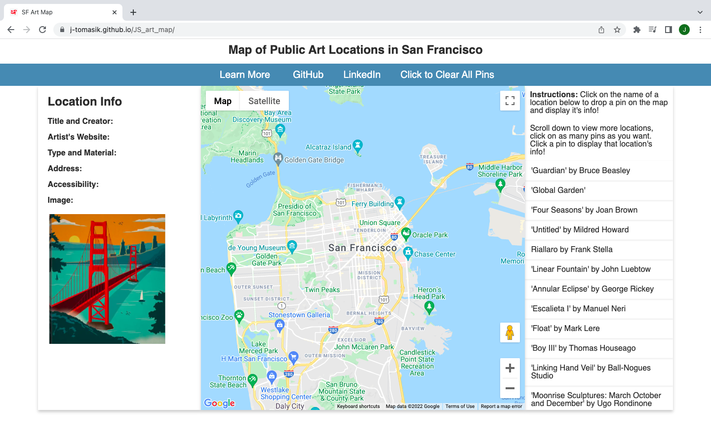
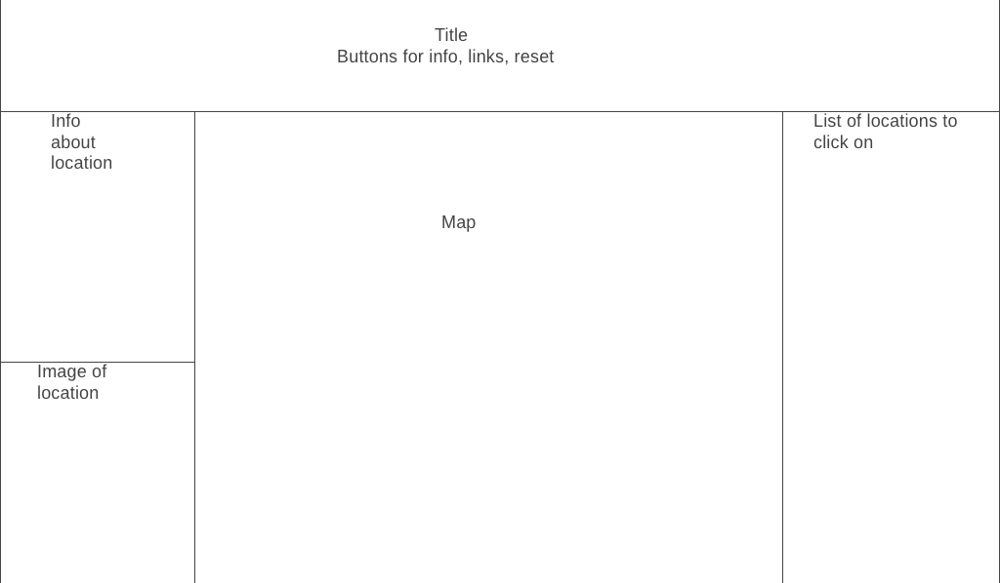

# Art of San Francisco

## Background:

Art of San Francisco is a web-based map application that helps the user to explore and learn about many of the amazing public art locations that the city has to offer. For this map, I plan on displaying a list of all the art locations involved in the city's "1% Art Program". More information about this program can be found in the Modal that appears when you click the "Learn More" button that also includes links to the project's website. 

The map will display the location of a public art piece as a pin on the map when they click on the art piece's name from the list on the right. Clicking this will also display information and a picture of the piece and can also be displayed by clicking on the pin.

## Link to Live Site:
[Link Here](https://j-tomasik.github.io/JS_art_map/)

Current Image of website:

## Functionality and MVPs:

In Art of San Francisco, users will be able to:

1) Zoom in and zoom out on the map

2) Use google maps street view

3) Scroll and Click on art location names from a list to drop pins and display the location's info

4) Click on pins to switch between which location's info you want to display

5) Mouse over a pin to display the name and address

6) Click on external links to learn more about a location

In addition, this project will include:

* Click a 'Learn more' button to pull up a modal that has background info on the art porject and links
* View an image of the art piece when it has been selected to display it's information
* Can also click on the clear all pins button to remove pins

## Wireframes:
* This wireframe is out of date as my project has been dynamically updated

* Once a pin or art piece name has been selected, the box on the left side of the map will display  info about the art piece and an img

## Libraries and APIs:

* Sfgov.org API/csv import
* html/css
* Vanilla Javascript
* Google maps API
* Google Geocoding API
* External links to learn more about locations and projects

## Implementation Timeline:

* 12/31 Thursday
  * Figure out what tools and which API library to use 
  * Get access to city API and familiarize with accessing 
* 1/3 Monday
  * Draw/import map of neighborhoods
* Create template for displaying single art location info
  * 1/4 Tuesday
* Work on CSS/HTML for display and smooth transitions
  * 1/5 Wednesday
  * See what other external resources could be added and polish
* 1/6 Thursday
  * Finish testing functionality and ensuring all locations have info

## Bonus Features:

* Could add in some data and statistics to compare the neighborhoods and their art. Such as how old on average the art is, what types of art is most common, which neighborhood has the highest density and concentration.

* Was thinking about using a Google maps API tool that finds the viewer's current location and can place that on the map.

* I could also add filters for catagories.

* Also I want to add in a feature so that when an image is clicked on, a modal with a bigger version of the picture appears.

